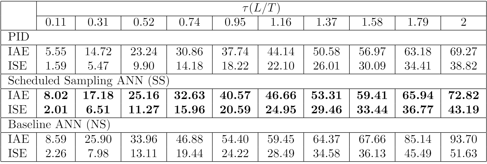

# ETFA24_SS
This repository contains the implementation of the Scheduled Sampling Training Framework for Artificial Neural Network (ANN)-based control systems, as proposed in the paper "Scheduled Sampling Training Framework for ANN-based Control."

## 1. Execution
To execute the notebooks and obtain the results, download the dataset from the following link: https://doi.org/10.34810/data1546.
Ensure that the dataset is properly integrated into the working environment and that the file paths in the notebooks (NS.ipynb and SS.ipynb) are correctly set to reference the downloaded data. The dependencies are listed in the file `requirements.txt`. 

Open the NS.ipynb and SS.ipynb notebooks, execute all necessary cells leading up to the final ones.

## 2. Results
The averaged error results for the 10 First Order Plus Dead Time (FOPDT) processes are showcased in the image below. These results were obtained after running 100 epochs with the default parameter settings, and early stopping was applied after 30 epochs without improvements.

